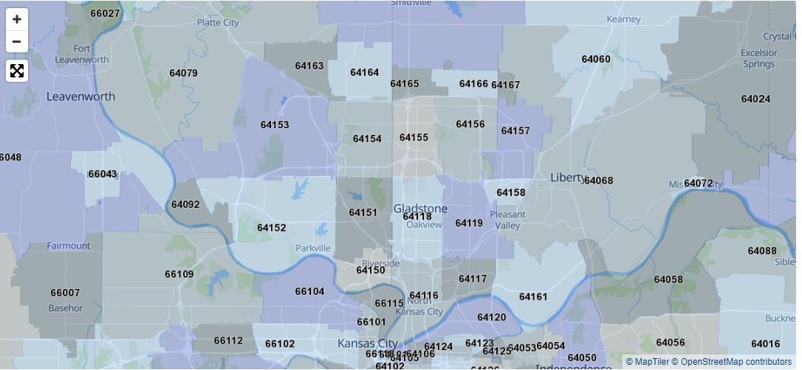
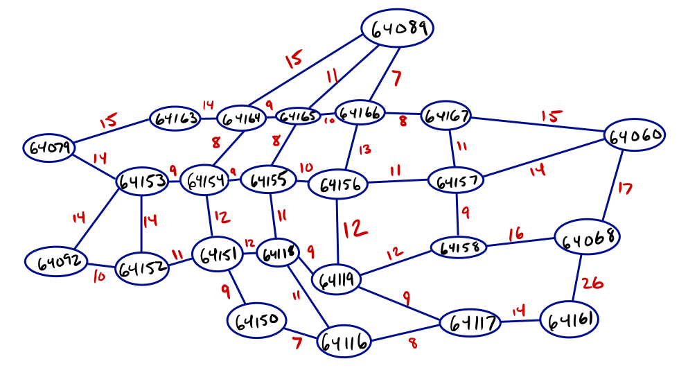

# Job Change Prediction

## Summary

This project simulates an emergency vehicle dispatch system. Emergency vehicles of certain types are located at nodes; calls randomly call in at specified ticks that request a vehicle type, and the program routes the closest vehicle of that type that isn't busy using Dijkstra's algorithm.

I’ve created a graph to emulate what the road network of the Kansas City Northland looks like (figure 1). I then created zip codes (represented by vertices) and roads (represented by edges) where the weight of the road is the time it takes to travel on that road between two zipcodes (figure 2).

To choose a suitable vehicle for a call request, you have to check whether a vehicle is available and whether or not it is the right type of vehicle. The project contains three types of vehicle (an enum class): ambulance, fire_truck, and police. I use Dijkstra’s to check the closest node to the source, and check if a vehicle is there; if it is, we send that vehicle, if it’s not, we check the next closest node to the source until we find one.

In order to demonstrate the algorithm, I created an emulator that emulates time (one “tick” of the emulator is considered 1 minute real time).

Through this project, I have abstracted away the need for someone to be able to discover the closest vehicle. They can input the zipcode of the call and type of emergency, and the dispatch system would do the rest if it were hooked to the necessary external sources of data such as GPS.

## Assumptions

With any program, certain assumptions have to be made about the scope.

Input has not been sanitized; this is already a very lengthy project, and adding input sanitization as well as try/catch blocks are important, however, they will make the program unwieldy unreadable to a grader, and I’m already well experienced in those manners—in other words, they aren’t what I’m testing myself on, so I felt little need to include them.

I have also assumed that it’s not needed to store the vertices and edges in a dynamically sized data structure. In a real world scenario, it would be absolutely necessary to use dynamically sized data structures in order to delete and insert new data. However, as the same problem exists for the previous paragraph, adding two-three lines of code every time I want to do anything with the vertices or edges would be confusingly unnecessary.

I also made an assumption about the amount of time it takes to get from zipcode A to zipcode B. I used Google Maps to calculate the time it takes from wherever Google Maps decided that the zipcode is located at. I also assumed that traveling within your own node takes 5 minutes (so if a call is within the node an emergency vehicle is at, it would take 5 minutes to respond). The last time assumption is that it takes 10 minutes for a vehicle to resolve the call once it arrives.

## Figures

  
Figure 1: The road network of Kansas City Northland.

Figure 2: A graphical representation of the road network of Kansas City Northland. The edges are the time taken to travel from zipcode to zipcode on Google Maps.

## Time Complexity

The most intensive function in the entire project is the Dijkstra’s algorithm (Request::assign_vehicle in Request.cpp) that calculates the closest vehicle. In general, Dijkstra’s is O((n+m)log n) where n is the vertices and m is the edges of a graph. For this project, Dijkstra’s would become faster, as we terminate as soon as an emergency vehicle is found instead of calculating the closest distance to every single vertex. We also use many data structures to represent distance, previous nodes, and the next node to check. These would be O(n) space complexity.

I believe there is one way to make the time complexity of the function more efficient without sacrificing crucial features of the program. Using memoization and heuristics, we can calculate the closest nodes for each node, and just look at those accordingly.

The vast majority of the functions in the program are getters, setters, and random number generators which are O(1). There are also variable loops that help initialization data sets and read data (such as the CSV from the file). These are all O(n), and the size of n is extremely small in these cases.

## Output

The output of the program are the fulfilled requests and which vehicle completed them.

## Further Questions & Future

In the future, some possible changes to the project could include:

- Add sanitization to any user input and a GUI/API.
- Adjust the graph so that the data structures are dynamic.
- I’m more familiar with SQL in which case it is very easy to do something such as primary keys; I created global variables here, and adjusted them accordingly as they were used. I assume there is a better way these should be done.
- In this program, it would realistically never happen that all vehicles would be busy. However, the program does test for this, and it waits for one to be available. It would be wise to have separate queues for different emergency types so that they can be operated on in similar fashion without sacrificing the reason for using a queue.
  - If all vehicles of one type is busy, a flag could be set to false signify that if a call is for police, don’t even try to iterate across the graph looking for an available police car. When a police car becomes available, it would set the flag to true.
